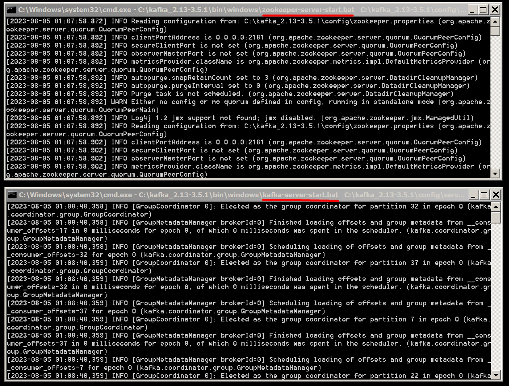

<a href="/README.md">вернуться к оглавлению</a>

<b>Установка Кафка</b>   

Скачиваем свежую версию с официального сайта 
`kafka.apache.org/downloads` 
и извлекаем содержимое архива. Скачиваем версию Binary, а не Source.  

В папке с Kafka находим папку config, в ней находим файл server.properties  
и открываем его. Находим строку  
`log.dirs= /tmp/kafka-logs`  
и указываем в ней путь (c учетом нашей папки), куда Kafka будет сохранять логи  
(почему то с правым слешем): 
`log.dirs=C:/kafka_2.13-3.5.1/kafka-logs`  

В этой же папке редактируем файл zookeeper.properties. 
Строчку `dataDir=/tmp/zookeeper`  
меняем на `dataDir=C:/kafka_2.13-3.5.1/zookeeper-data` 
не забывая при этом, после имени диска указывать путь к своей папке с Kafka. 
Если вы всё сделали правильно, можно попробовать запускать ZooKeeper и Kafka.  

**Пробный запуск ZooKeeper и Kafka последовательно** 
Создаем .bat файл для запуска, чтобы каждый раз не писать код, например start.bat,  
и вписываем туда примерно следующее:(адрес вашей папки с Kafka может отличаться) 

<pre>
REM файл для запуска zookeeper а потом Kafka
start C:\kafka_2.13-3.5.1\bin\windows\zookeeper-server-start.bat
C:\kafka_2.13-3.5.1\config\zookeeper.properties
timeout 10
start C:\kafka_2.13-3.5.1\bin\windows\kafka-server-start.bat
C:\kafka_2.13-3.5.1\config\server.properties
</pre>

Если все получилось правильно, после запуска .bat файла  сначала  
запустится ZooKeeper с большим количеством информационных сообщений:

<pre>
[2023-08-03 02:59:04,890] INFO Reading configuration from:
C:\kafka_2.13-3.5.1\config\zookeeper.properties
(org.apache.zookeeper.server.quorum.QuorumPeerConfig)
[2023-08-03 02:59:04,890] INFO clientPortAddress is 0.0.0.0:2181
(org.apache.zookeeper.server.quorum.QuorumPeerConfig)
[2023-08-03 02:59:04,890] INFO secureClientPort is not set
(org.apache.zookeeper.server.quorum.QuorumPeerConfig)
[2023-08-03 02:59:04,890] INFO observerMasterPort is not set
(org.apache.zookeeper.server.quorum.QuorumPeerConfig)
[2023-08-03 02:59:04,905] INFO metricsProvider.className
is org.apache.zookeeper.metrics.impl.DefaultMetricsProvider
(org.apache.zookeeper.server.quorum.QuorumPeerConfig)
...
</pre>

а через 10 секунд в другом окне запустится Kafka c разными сообщениями от неё

<pre>
       kafka.metrics.reporters = []
       leader.imbalance.check.interval.seconds = 300
       leader.imbalance.per.broker.percentage = 10
       listener.security.protocol.map = PLAINTEXT:PLAINTEXT,
       SSL:SSL,SASL_PLAINTEXT:SASL_PLAINTEXT,SASL_SSL:SASL_SSL
       listeners = PLAINTEXT://:9092
       log.cleaner.backoff.ms = 15000
       log.cleaner.dedupe.buffer.size = 134217728
       log.cleaner.delete.retention.ms = 86400000
       log.cleaner.enable = true
       log.cleaner.io.buffer.load.factor = 0.9
       log.cleaner.io.buffer.size = 524288
       log.cleaner.io.max.bytes.per.second = 1.7976931348623157E308
       log.cleaner.max.compaction.lag.ms = 9223372036854775807
...
</pre>

Примечания 
Как я понимаю прерывается работа этих приложений с помощью CTRL+C в каждом окне. 
Не выключайте приложения, пока запускаете проект 

Как выглядят запущенные приложения
 