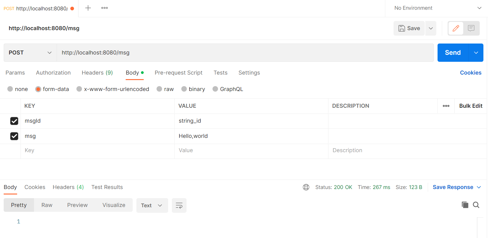
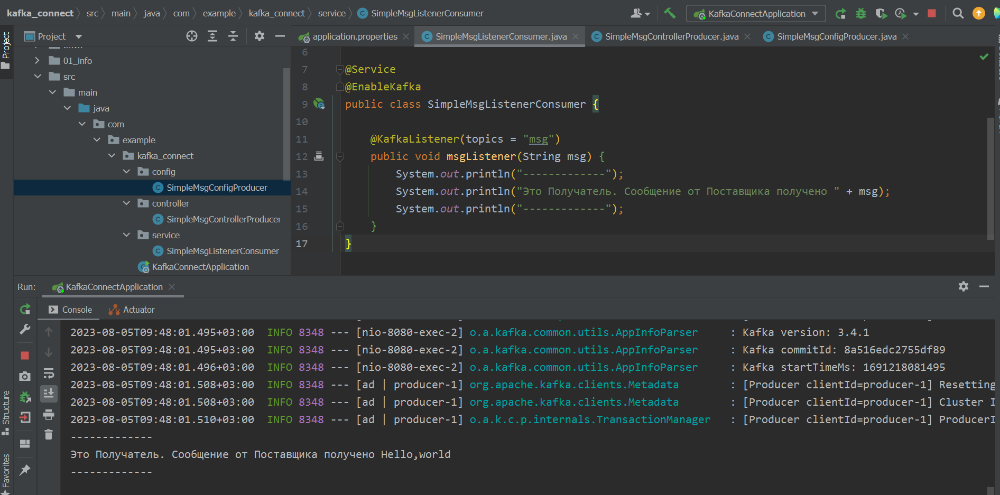

<a href="/README.md">вернуться к оглавлению</a>

<b>Простой вариант использования Kafka</b>   

Порядок запуска: 
~ запускаем связку приложений ZooKeeper и Kafka c помощью start.bat 
(см предыдущие части) 
~ запускаем приложение 
src/main/java/com/example/kafka_connect/KafkaConnectApplication.java 
~ запускаем Postman  

В Postman создаем запрос типа Post: 
адрес: `http://localhost:8080/msg`  
Body (form-data)  
key: `msgId` value: `string_id` 
key:`msg` value: `Hello, world` 
Запрос прошёл - Status 200 Ok

Картинка запроса

  

Описание схемы прохождения запроса (simple).  
Запрос проходит следующие этапы:  
~ создаем запрос в Postman 
~ для этого запроса используется файл конфигурации 
src/main/java/com/example/kafka_connect/config/SimpleMsgConfigProducer.java 
в котором мы описываем шаблон сообщения (бин) 
simpleKafkaTemplate()  
который мы внедрим в следующий контроллер.  
~ далее запрос и принимается и обрабатывается и отпраляется контроллером  
src/main/java/com/example/kafka_connect/controller/SimpleMsgControllerProducer.java  
и отправляется в Кафку  
~ далее запрос от Кафки принимается сервисом (слушателем, консьюмером, потребителем) 
src/main/java/com/example/kafka_connect/service/SimpleMsgListenerConsumer.java 
который, для примера, выводит его в консоль

Результат работы Consumer

   

Примечание:  
Если вы хотите чтобы тип id был не String а Long вы можете использовать другой  
конфигурационный файл:  
src/main/java/com/example/kafka_connect/config/LongMsgConfigProducer.java  
взять оттуда соответственно другой бин:  
longKafkaTemplate()   
и использовать его в контроллере.  