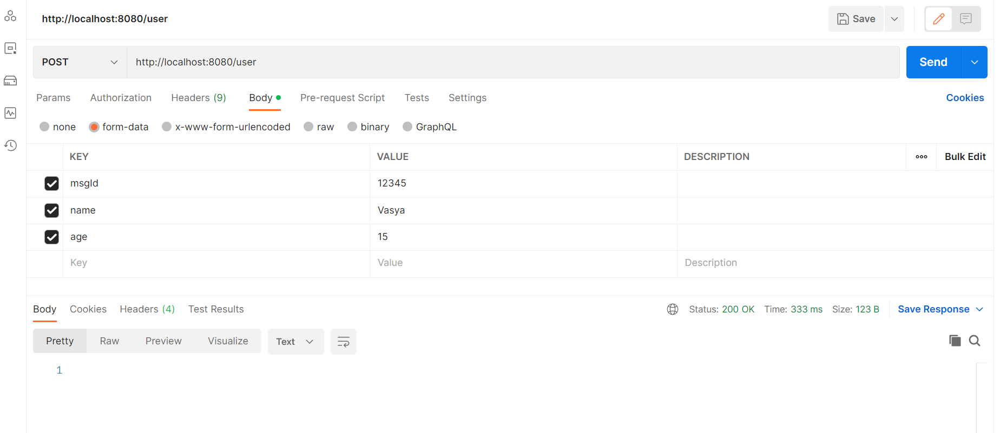
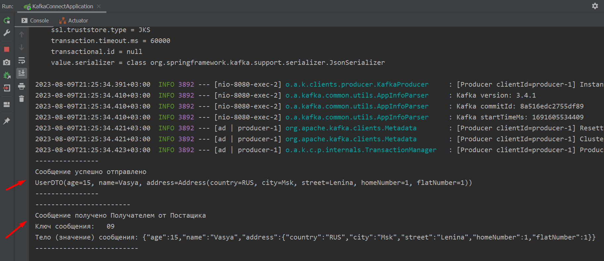

<a href="/README.md">вернуться к оглавлению</a>

<b>Более сложный вариант использования Kafka</b>   

Немного усложним наш проект и представим, что нам нужно  
отправить Потребителю объект (передать модель) UserDTO 

Порядок запуска (как и в простом случае): 
~ запускаем связку приложений ZooKeeper и Kafka c помощью start.bat 
~ запускаем приложение 
src/main/java/com/example/kafka_connect/KafkaConnectApplication.java 
~ запускаем Postman  

В Postman создаем запрос типа Post для передачи юзера : 
адрес: `http://localhost:8080/user`  
Body (form-data)  
key: `msgId` value: `12345` 
key:`name` value: `Vasya` 
key:`age` value: `15` 
Запрос прошёл - Status 200 Ok

Картинка запроса

  

Описание схемы прохождения запроса (user).  
Запрос проходит следующие этапы:  
~ создаем запрос в Postman 
~ для этого запроса используется файл конфигурации специально для User 
src/main/java/com/example/kafka_connect/config/UserMsgConfigProducer.java 
в котором мы описываем шаблон сообщения (бин) 
userKafkaTemplate()  
который мы внедрим в следующий контроллер.  
~ далее запрос и принимается и обрабатывается и отпраляется контроллером  
src/main/java/com/example/kafka_connect/controller/UserMsgControllerProducer.java  
и отправляется в Кафку  
~ далее запрос от Кафки принимается сервисом (слушателем, консьюмером, потребителем) 
src/main/java/com/example/kafka_connect/service/UserMsgListenerConsumer.java 
который, выводит его в консоль

Результат работы Поставщика и Потребителя в консоли

   

Примечание  
Так как усложнился конфиг Продюсера, нужно усложнить и конфиг Потребителя  
src/main/java/com/example/kafka_connect/config/UserMsgConfigConsumer.java 